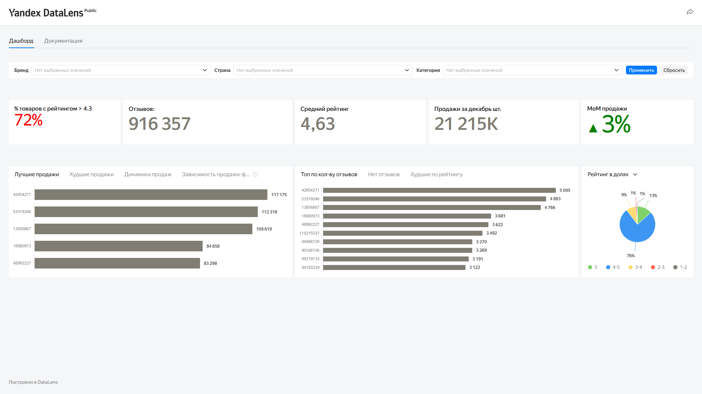

# Анализ удовлетворенности покупателей (Yandex DataLens)

## Цель проекта
Разработать информативный дашборд для оценки восприятия брендов клиентами и анализа эффективности ассортимента товаров (в сфере красоты) на маркетплейсе с целью стимулирования продаж.

## Задачи проекта
- Разработать Canvas (архитектуру) дашборда для различных ролей (аналитики, категорийные менеджеры).
- Визуализировать ключевые показатели удовлетворенности (рейтинги, отзывы).
- Выявить товары с низким рейтингом (< 4.3) и недостаточным количеством отзывов.
- Проанализировать зависимость удовлетворенности от визуального наполнения (количества фото и наличия видео в карточках товаров).

## Методология и инструменты
- **Инструменты:** Yandex DataLens, Yandex Disk (для Canvas).
- **Методы:** Проектирование BI-архитектуры, агрегация метрик (Индекс удовлетворенности), визуализация данных (BI-отчетность).

## Источники данных
Ежемесячные и полугодовые выгрузки данных маркетплейса с характеристиками товаров:
- Основные метрики: SKU, категория, предмет, бренд, продажи, отзывы, рейтинг, количество фото, наличие видео, страна производителя.

## Результаты и выводы
Разработан единый дашборд, исключающий необходимость ручного сбора данных и автоматизирующий ежемесячную отчетность (в т.ч. перед CPO).
Анализ показал, что добавление качественного визуального контента (фото и видео) в карточку товара напрямую коррелирует с ростом конверсии в покупку. Установлено, что ряд брендов стабильно имеют индекс удовлетворенности ниже целевых 80%, что стало поводом для исключения части SKU из ассортимента.

## Визуализация данных

*Интерфейс итогового дашборда в Yandex DataLens:*

  

Интерактивный дашборд, позволяющий фильтровать и анализировать метрики в разрезе:
- Категорий и типов товаров.
- Брендов и стран производителей.
- Временной динамики (по месяцам).

## Применение результатов
Дашборд используется на ежемесячных встречах команды. На основе его данных принимаются решения:
- О переработке карточек товаров (визуал, описание) для товаров с рейтингом < 4.3.
- О проведении дополнительного лабораторного тестирования качества товаров.
- Об исключении низкорейтинговых позиций из ассортимента.
- О запуске акций для стимулирования обратной связи (отзывов) от покупателей.

## Ограничения и сложности
Сбор данных о показателях брендов за последние полгода производился в полуавтоматическом режиме. Дашборд позволил решить эту проблему и автоматизировать мониторинг в динамике.
